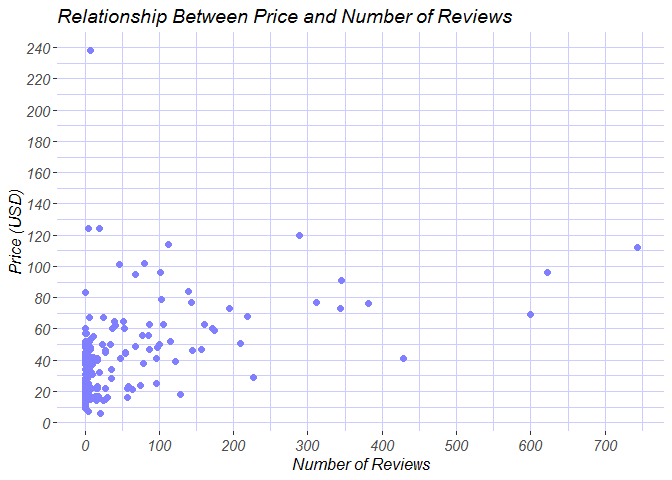
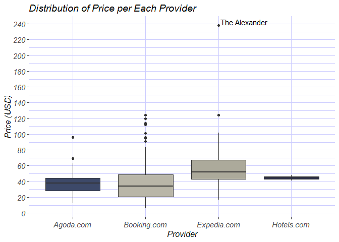
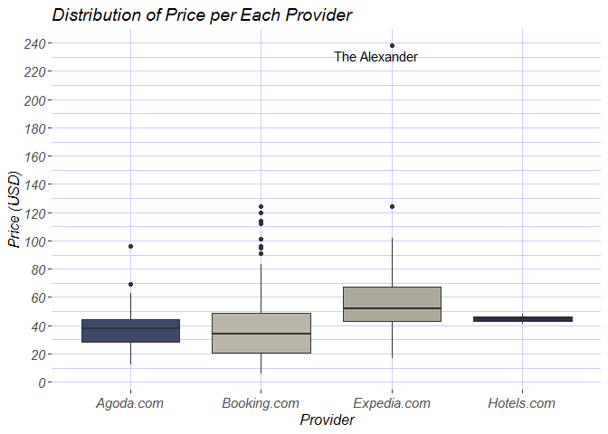
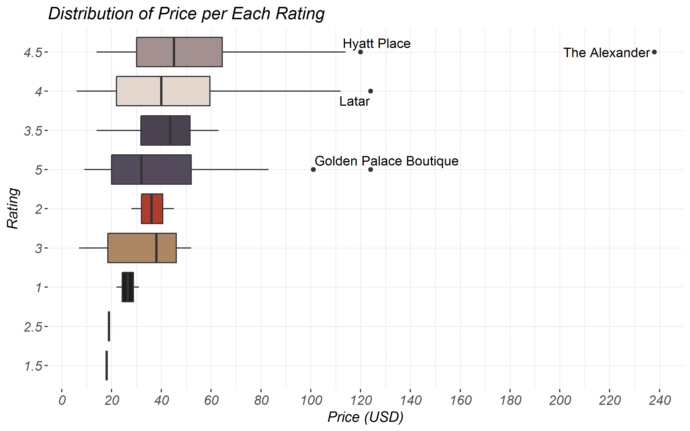

Hotels in Yerevan
================
Hermine Grigoryan
15 August, 2018

true

         

The data for the analysis was scraped from TripAdvisor. It contains information about Yerevan hotels, i.e. their prices, number of reviews, providers and other details. Several types of plots were used for visualizing the data. I used **martirossaryan** package to give colors to the plots.

         

The Most Expensive Hotels in Yerevan
------------------------------------

Of all Yerevan hotels, the most expensive one is The Alexander hotel, as can be seen in the barplot. The price on the plot indicates the average price for one room for two adults. It is interesting to note that The Alexander hotel is twice as expensive as the next hotel room on the plot.

The Most Reviewed Hotels in Yerevan
-----------------------------------

 This barplot shows the top 10 hotels with the biggest number of reviews. Armenia Marriott is the Yerevan branch of the hotels chain and tops this list. It is one of the most well-known hotels and can be expected to have a high number of reviews. Some of the relatively newer hotels in Yerevan - Double Tree by Hilton and Hyatt Place - have remarkably been working productively to gain many reviews to appear in this top 10.

How the Price and the Number of Reviews are Interconnected
----------------------------------------------------------

This scatterplot shows the relationship between the price for one room for 2 adults and the number of reviews the hotel has. From this illustration we cannot claim that the price has a significant effect on the number of reviews the hotel has. The two variables are not highly correlated.

Are the Prices for Each Provider Different? - Boxplot
-----------------------------------------------------

 The boxplot above shows that the prices of each provider do not differ significantly from each other. The provider of the most expensive hotel in Yerevan is Expedia.com. The medium price for the hotels in Yerevan is 40 USD. The provider with the most unusual prices is Booking.com. However, along with looking at the boxplot for finding outliers, we shouldn't also forget if the data is balanced for each provider. Let's see how frequent each of the providers appear in list of Yerevan hotel providers.

| Provider    |  Frequency|
|:------------|----------:|
| Agoda.com   |         13|
| Booking.com |        155|
| Expedia.com |         27|
| Hotels.com  |          2|

We see that the most frequent hotel provider is Booking.com. That is why it has the most number of outliers.

Are the Prices for Each Provider Different? - Violin
----------------------------------------------------

Now, let's analyze the same data with a different type of a graph - violin.

This type of a graph shows the same picture, along with the distribution of the data.

Distribution of Price
---------------------

This histogram shows a right-skewed distribution of prices. The most frequent prices are in a range of 10 - 60. The Alexander hotel is a far outlier as can be seen.

Frequency of Ratings
--------------------

This barplot shows the top frequent ratings for all the hotels. There are more than 50 hotels with a rating of 4.5. Fewer hotels have the highest rating - 5.

Distribution of Price per each Rating
-------------------------------------

The boxplot and the violin above show the distribution of price for each rating. There are not many outliers for ratings. We see that *The Alexander* and *Hyatt Place*, the most expensive hotels, have the rating of 4.5. Hotel *Golden Palace Boutique* has the highest rating of 5, with a relatively low price.

How many hotels have the following services?
--------------------------------------------

As the barplot shows, most of the hotels (119 from 197) have access WiFi. Around 95 of the hotels have free parking. In 16 of them breakfast is included. No more than 6 of the hotels have official website, swimming pool and restaurant. 5 of the hotels have special offers.
